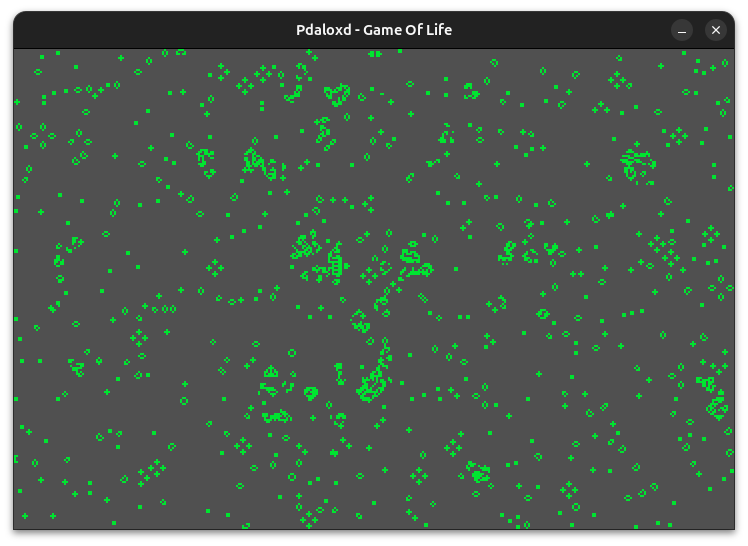
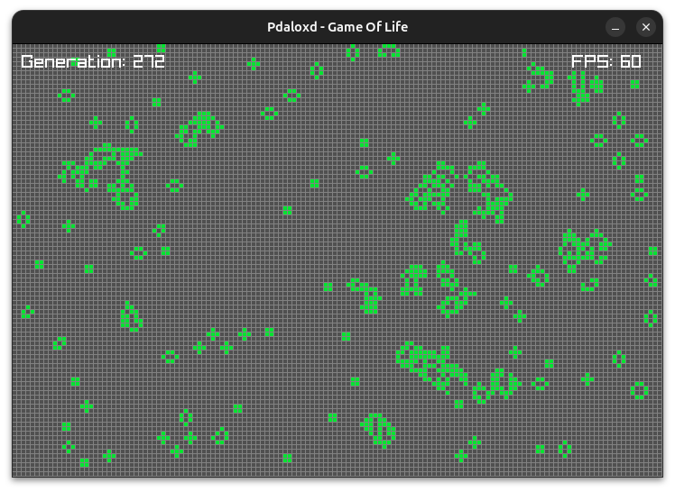

# Interactive Game of Life

This repository contains an interactive implementation of Conway's Game of Life using the raylib library. The Game of Life is a cellular automaton devised by the British mathematician John Horton Conway in 1970.

## Features

- **Interactive Controls**: Pause and resume the game, show grid lines, FPS, and generation counter with keyboard inputs.
- **Mouse Interactions**: Draw and erase cells using the mouse.
- **Real-time Updates**: Visualize the evolution of the game in real-time.

## Controls

- **Spacebar**: Pause/Resume the game.
- **S key**: Show/Hide grid lines, FPS, and generation counter.
- **Mouse Left Click**: Draw cells.
- **Mouse Right Click**: Erase cells.

## Installation

To run this project, you need to have raylib installed on your system. Follow the instructions below to set up and run the project.

### Prerequisites

- **raylib**: Follow the official raylib installation guide to install raylib on your system.

### Clone the Repository

1. Clone the repository:
    ```
    git clone https://github.com/pablodrake/GOL
    cd GOL
    ```

### Build and Run

1. Compile the project:
    ```
    g++ main.cpp -o main -lraylib -lpthread -lm
    ```

2. Run the executable:
    ```
    ./main
    ```

## Usage

1. Launch the executable to start the Game of Life.
2. Use the mouse to draw (left click) or erase (right click) cells.
3. Press the spacebar to pause or resume the simulation.
4. Press the 'S' key to toggle the display of grid lines, FPS, and the generation counter.

## Examples




## License

This project is licensed under the MIT License. See the [LICENSE](LICENSE) file for details.

## Acknowledgements

- [raylib](https://www.raylib.com/) - A simple and easy-to-use library to enjoy videogames programming.
- John Horton Conway - Creator of the [Game Of Life](https://en.wikipedia.org/wiki/Conway%27s_Game_of_Life).

## Contributing

Contributions are welcome! Please open an issue or submit a pull request for any improvements or bug fixes.

## Contact

For questions or suggestions, please open an issue in this repository or contact me directly at [pablosantanatorres@gmail.com](mailto:pablosantanatorres@gmail.com).
